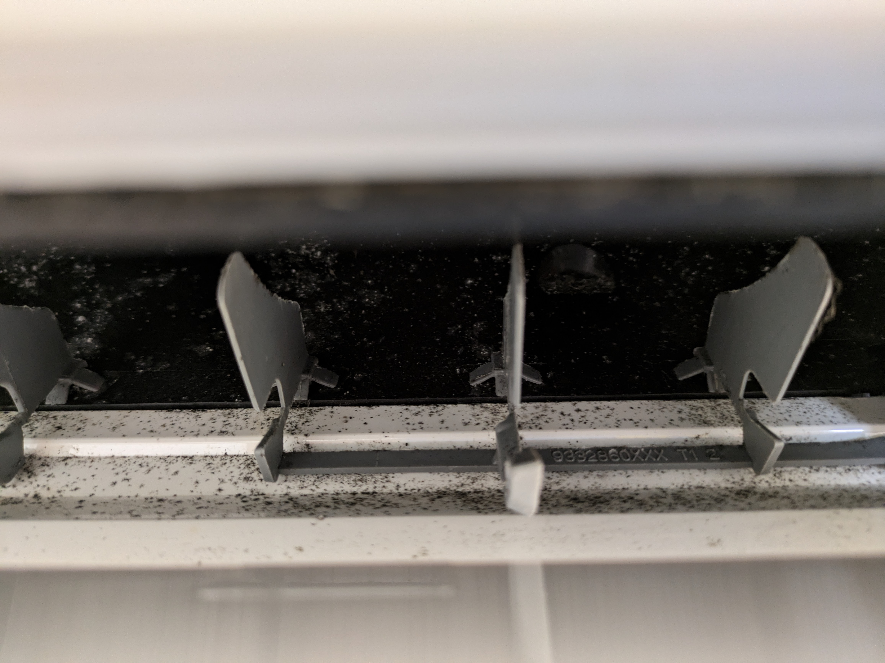

## 为什么选择自己清洗空调

用了4年多的空调，只清洗过空气过滤网。风扇上布满了厚厚的灰尘，周围散布着黑色的霉点。不清洗不行了。

最初打算请专业人士来清扫的，在 くらしのマーケット（生活市场）和 お掃除本舗（清洁总店）看了看。生活市场相当于中介网站，你可以找自己觉得合适的提供空调清洗服务的人，价钱不到1万日元，缺点是服务质量不一，不知道选泽哪个人好。清洁总店的服务看起来更专业一些，价钱要1万多日元。

然后看了 [エアコンクリーニング絶対やってはいけないクリーニング方法](https://www.youtube.com/watch?v=Ra70MfKBOm8)（空调清洗一定不能做的事），视频说了目前专业空调清洗的陷阱，用高压水枪看上去把表面的清洗干净了，但是如果不先把风扇上堆积的灰尘清洗干净的话，会适得其反，把污渍冲到风扇里面而得不到清洗。之后又看了  [【エアコン掃除は自分でできる】業者テク&100均グッズだけでクリーニング！](https://www.youtube.com/watch?v=rT5wciOPIn8) (【空调清洁可以自己动手】使用专业技巧和100日元店商品进行清洁！)，视频介绍了如何使用百元店的低价商品，像专业人士一样清洗空调。想想请专业人士来可能也洗不干净，还不如自己动手。

## 道具

基本上按照 YOUTUBE 上的视频选择道具。视频上说全部在 DAISO 上买，因为我去的那家 DAISO 有一些商品没货，我还去了附近的其他百元店和家装建材中心（ホームセンター）。遮蔽胶带和护目镜百元店没有，在家装建材中心买的。

主要道具为：
- 适用于塑料瓶的加压式喷雾器（ペットボトル用加圧式霧吹き）
- 结实的塑料瓶（頑丈なペットボトル），碳酸饮料1L的，没有的话 500 ml 的也可以
- 90L或70L塑料袋2个以上（90L or 70L ゴミ袋 2枚以上）
- 遮蔽胶带（マスカー） 1 个
- 保护胶带（養生テープ）1个
- 牙刷3把（歯ブラシ3枚）
- 水桶1个（バケツ 1個）
- 1条浴巾（バスタオル 1枚）
- 1条毛巾（ハンドタオル1枚）
- 十字螺丝刀（十字ドライバー）
- 护目镜（ゴーグル）
- 中性食器用清洁剂（中性食器用洗剤），40度热水和清洁剂以10:1的比例混合后使用
- 碱性电解水（アルカリ電解水）
- 蓬松扫把（ふわっとモップ）

## 清洗步骤

基本上按照 YOUTUBE 视频的步骤做。

1. 拆空调前面挡板，空气滤网导风版。
2. 拆本体外壳（本体パネル）。这个稍微需要点技巧。要先找到外壳跟空调本体的钩子，将其解开后才能把外壳拆下来。
   - 注意不要用蛮力硬拉，拉不下说明钩子还没有解开。在视频网站搜索【空调型号 + 外し方】可能能找到拆解的视频。
   - 或者去空调的官网，找设置说明书（据付説明書），注意不是使用说明书，里面有外壳拆解方法的说明。我的空调是富士通的，在[这里](https://www.fujitsu-general.com/jp/support/downloads/search/index.html)可以下载。
3. 拆除出风口的导风叶片。没有找到我的空调的这个的拆解方法，没能拆下来。硬拆了几片，结果把下面的钩子的一部分弄坏了，得不偿失。吸取教训，不要强拆。还好清洗后还能用。没能把导风叶片拆下来导致之后清洗风扇很费尽。也因此无法用上碱性电解水（アルカリ電解水）和蓬松扫把（ふわっとモップ）来清洗出风口的地方。
4. 用遮蔽胶带，保护胶带，和塑料袋，制作清洗保护装置，防止清洗的过程中，清洗剂和水晒在空调本体上，并将其引导到下方的水桶上，防止弄脏墙壁和地板。注意尤其是不能将水晒到右方的电路装置上，否则空调立马就坏了。

   制作好的清洗保护装置，看起来有模有样。

   

   

5. 用喷水装置喷清洁剂。
6. 放置20分钟，期间清洗拆下来的外壳。因为外壳有很多顽固的污渍，用了强力霉菌清洗剂（強力カビハイター）。注意这个不能直接用于空调的清洗，因为可能会使空调内部的金属生锈。
7. 用喷水装置装自来水冲洗，多冲洗几遍，把清洁剂冲干净。
8. 保持清洗保护装置，开暖风3个小时（万幸，空调没有坏），吹干清洗的水分，使空调内部干燥。
9. 擦干外壳，装在空调上，完成。

## 效果

清洗前：

清洗后：

总体上不错，但风扇还是很脏，但我尽力了。关于自己如何更好地清理空调风扇，如果有时间和精力（还不怕累）的话，可以参考这个：[エアコン送風ファン時短掃除DAISOの商品で](https://www.youtube.com/watch?v=IGpnw4rLEHQ) （使用DAISO的商品快速清洁空调送风风扇）。不知道专业人士清理得时候能否做到这么细致。

## 最后

自己空调清洗，是个不错的体验，也是一个很艰难的体验。因为第一次清洗，很怕一不小心就搞坏了，全程小心操作，前后花了 6 个多小时，太累了。下次还会自己清洗空调吗？还说不准。
